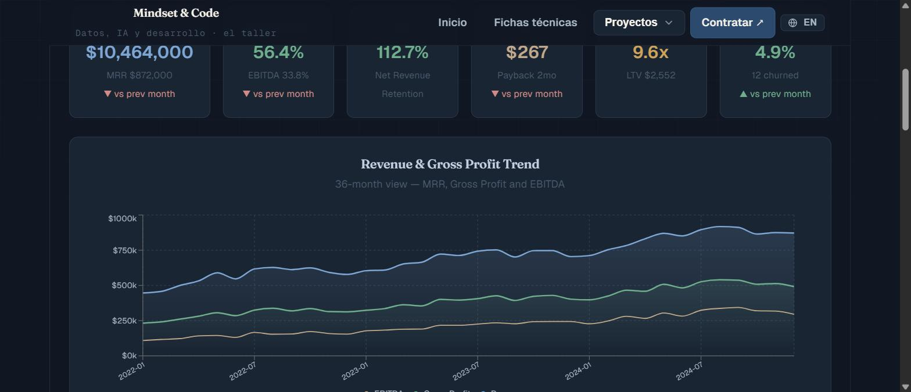
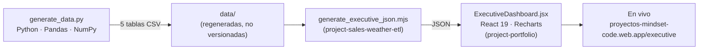

# Executive Dashboard 360° — SaaS Revenue & RevOps Analytics

> **Business Intelligence portfolio project** · Python · Pandas · React · Recharts
> **Status:** Finished · Live in production
> A reproducible synthetic-data engine that models the complete financial and revenue-operations picture of a B2B SaaS company — **24 executive KPIs** across Finance, Retention, RevOps and Marketing — feeding an interactive executive dashboard.

> 🇬🇧 **English version first.** · 🇪🇸 **La versión en español está más abajo** → [ir a Español](#-español).

[](https://proyectos-mindset-code.web.app/executive)
[](https://mindset-code.com/es/codigo)
[](.)
[](.)
[](LICENSE)

[](https://proyectos-mindset-code.web.app/executive)

*[Open the live demo](https://proyectos-mindset-code.web.app/executive)*

---

## Table of Contents

- [The problem this solves](#the-problem-this-solves)
- [Live demo](#live-demo)
- [Key features](#key-features)
- [Architecture](#architecture)
- [Methodology — how the data is modeled](#methodology--how-the-data-is-modeled)
- [The data model & 24 KPIs](#the-data-model--24-kpis)
- [Results & insights](#results--insights)
- [Tech stack](#tech-stack)
- [Getting started](#getting-started)
- [Repository structure](#repository-structure)
- [Related repositories](#related-repositories)
- [License](#license)
- [Contact](#contact)

---

## The problem this solves

Executives don't read spreadsheets — they read **a single screen** that answers *"how is the business doing?"* in ten seconds. Producing that screen is a Business Intelligence problem with three layers that must work together:

1. **Metric definition** — knowing *which* numbers actually run a SaaS business (not vanity metrics) and how they relate.
2. **Data modeling** — generating internally consistent data so every KPI reconciles (`MRR × 12 = ARR`, margins tie to COGS, retention ties to cohorts).
3. **Communication** — visualizing it so a non-technical leadership team grasps the story instantly.

This project demonstrates all three, end to end. It builds a realistic 3-year dataset for a B2B SaaS company and exposes it through an executive dashboard that consolidates **Finance, Retention, RevOps and Marketing** into one coherent 360° view — the same artifact a Revenue Operations or BI team maintains for a monthly leadership review.

It is a **portfolio piece**: the data is synthetic by design, but the metric model, the engineering and the visualization mirror real production BI work.

---

## Live demo

**▶ [proyectos-mindset-code.web.app/executive](https://proyectos-mindset-code.web.app/executive)**

The dashboard renders the 24 KPIs as KPI cards, revenue trends, segment/channel breakdowns, a marketing funnel, a CAC↔LTV trend and a churn↔NRR trend.

---

## Key features

- **Single coherent financial model** — every table is derived from one revenue backbone, so figures reconcile across Finance, Marketing, Sales and Retention.
- **24 executive KPIs** spanning four business domains (full list below).
- **Realistic dynamics** — growth trend + seasonality (stronger Q4, softer Q1), improving margins over time, and cohort-driven churn/NRR.
- **Fully reproducible** — `np.random.seed(42)` guarantees identical output on every run; no private or scraped data.
- **Clean separation of concerns** — the data layer (this repo) is independent from the presentation layer (React app), so the model can be audited and regenerated on its own.

---

## Architecture

A three-stage, multi-repository data pipeline:


| Stage | Repository | Role |
|-------|-----------|------|
| **Data engine** | `project-executive-dashboard-data` *(this repo)* | Generates the 24-KPI dataset |
| **JSON build** | `project-sales-weather-etl` | Converts tables to web-ready JSON |
| **Presentation** | `project-portfolio` | React dashboard, served live |

---

## Methodology — how the data is modeled

The generator does not emit random noise; it encodes a believable SaaS trajectory:

- **Revenue** follows a linear growth **trend** (≈ $480K → $920K monthly) plus **seasonality** (a 12-month sine wave) and gaussian noise, floored to avoid negative dips.
- **Margins improve** as the company matures — COGS falls from ~48% to ~41% of revenue, so gross margin climbs from ~52% to ~59%.
- **Unit economics** are derived, not invented: CAC from marketing spend ÷ new customers; LTV from revenue-per-customer ÷ churn; `LTV/CAC` kept in a healthy band.
- **Retention** uses customer cohorts — churn declines from ~8% to ~4%, and NRR is clamped to a realistic 70%–140% range driven by expansion minus contraction and churn.
- **Marketing funnel** ties spend → MQLs → SQLs with conversion rates that improve over time.

This is the core BI skill the project showcases: **building a model where every metric is causally and arithmetically consistent with the others.**

---

## The data model & 24 KPIs

The core `executive_summary` table carries **24 KPIs** across four domains:

| Domain | KPIs |
|--------|------|
| **Finance** | Revenue · Gross Profit · Gross Margin % · EBITDA · EBITDA Margin % · MRR · ARR |
| **Retention** | Churn Rate · Churned Customers · NRR · Expansion Revenue |
| **RevOps / Unit economics** | CAC · LTV · LTV/CAC · Payback (months) · Win Rate · Sales Cycle (days) · Pipeline Value · Pipeline Coverage |
| **Marketing** | Marketing Spend · MQLs · SQLs · New Customers · ROAS |

Four breakdown tables provide the dimensional cuts the dashboard charts:

| Table | Rows | Breakdown |
|-------|------|-----------|
| `executive_summary` | 36 | Monthly KPI panel (24 metrics) |
| `revenue_by_segment` | 108 | SMB · Mid-Market · Enterprise |
| `revenue_by_channel` | 144 | Inbound · Outbound · Partners · Direct |
| `marketing_funnel` | 36 | Spend · MQL → SQL · CAC · ROAS |
| `pipeline_stages` | 180 | 5 funnel stages × 36 months |

**Coverage:** 36 months (3 years) · 3 customer segments · 4 acquisition channels.

---

## Results & insights

Reading the generated dataset the way an analyst would brief leadership:

- **Revenue nearly doubles** over three years while **gross margin expands ~7 points** — growth is becoming *more* profitable, not less.
- **NRR stays above 100%** in mature months: the existing customer base expands faster than it churns — the strongest signal of product-market fit.
- **LTV/CAC trends above 3×**, the canonical threshold for efficient, scalable acquisition.
- **Churn roughly halves** (≈8% → ≈4%) as the company matures, compounding the revenue base.

These are the four sentences a RevOps analyst would lead a board meeting with — and the dashboard makes each visible at a glance.

---

## Tech stack

| Layer | Technology |
|-------|-----------|
| Data generation | Python 3.12 · Pandas · NumPy |
| Visualization | React 19 · Vite · Recharts (in `project-portfolio`) |
| Hosting | Firebase Hosting (Spark plan) |
| Domain | RevOps · Business Intelligence · SaaS metrics |

---

## Getting started

### Prerequisites
- Python 3.12+

### Installation
```bash
git clone https://github.com/mindset-code/project-executive-dashboard-data.git
cd project-executive-dashboard-data
python -m venv .venv && source .venv/bin/activate
pip install -r requirements.txt
```

### Usage
```bash
python generate_data.py        # writes the 5 analytical tables to data/
```

Expected output:
```
✓ executive_summary.csv     — 36 rows, 24 KPIs
✓ revenue_by_segment.csv    — 108 rows
✓ revenue_by_channel.csv    — 144 rows
✓ marketing_funnel.csv      — 36 rows
✓ pipeline_stages.csv       — 180 rows
```

To see the data rendered, open the [live dashboard](https://proyectos-mindset-code.web.app/executive) or run the [`project-portfolio`](https://github.com/mindset-code/project-portfolio) frontend locally.

---

## Repository structure

```
project-executive-dashboard-data/
├── generate_data.py     # synthetic SaaS data engine (5 tables, 24 KPIs)
├── requirements.txt     # Python dependencies
├── data/                # generated CSV output (not versioned)
├── init.sh              # pre-session environment check
├── LICENSE              # MIT
└── README.md
```

---

## Related repositories

- **[project-portfolio](https://github.com/mindset-code/project-portfolio)** — React frontend that renders this dashboard (live at `/executive`).
- **[project-sales-weather-etl](https://github.com/mindset-code/project-sales-weather-etl)** — JSON build step for the web layer.
- **Full portfolio:** [proyectos-mindset-code.web.app](https://proyectos-mindset-code.web.app)

---

## License

Released under the **[MIT License](LICENSE)** — free to use, modify and distribute with attribution.

---

## Contact

- **Portfolio:** [proyectos-mindset-code.web.app](https://proyectos-mindset-code.web.app)
- **Web:** [mindset-code.com](https://mindset-code.com/es)
- **Email:** contacto@mindset-code.com

---

# 🇪🇸 Español

# Executive Dashboard 360° — Analítica de revenue y RevOps SaaS

> **Proyecto de portafolio de Business Intelligence** · Python · Pandas · React · Recharts
> **Estado:** Terminado · En producción
> Motor de datos sintéticos reproducible que modela la foto financiera y de revenue-operations completa de una empresa SaaS B2B —**24 KPIs ejecutivos** en Finanzas, Retención, RevOps y Marketing— y alimenta un dashboard ejecutivo interactivo.

> 🇪🇸 Traducción al español. La versión en inglés está al inicio → [ir a English](#executive-dashboard-360--saas-revenue--revops-analytics).

---

## Índice

- [El problema que resuelve](#el-problema-que-resuelve)
- [Demo en vivo](#demo-en-vivo)
- [Características clave](#características-clave)
- [Arquitectura](#arquitectura-1)
- [Metodología — cómo se modelan los datos](#metodología--cómo-se-modelan-los-datos)
- [El modelo de datos y los 24 KPIs](#el-modelo-de-datos-y-los-24-kpis)
- [Resultados e insights](#resultados-e-insights)
- [Stack técnico](#stack-técnico)
- [Cómo empezar](#cómo-empezar)
- [Estructura del repositorio](#estructura-del-repositorio)
- [Repositorios relacionados](#repositorios-relacionados)
- [Licencia](#licencia)
- [Contacto](#contacto)

---

## El problema que resuelve

Un directivo no lee hojas de cálculo — lee **una sola pantalla** que responde *"¿cómo va el negocio?"* en diez segundos. Producir esa pantalla es un problema de Business Intelligence con tres capas que deben encajar:

1. **Definición de métricas** — saber *cuáles* números mueven de verdad un negocio SaaS (no métricas de vanidad) y cómo se relacionan.
2. **Modelado de datos** — generar datos internamente consistentes para que cada KPI cuadre (`MRR × 12 = ARR`, los márgenes atan con el COGS, la retención ata con las cohortes).
3. **Comunicación** — visualizarlo para que un equipo directivo no técnico capte la historia al instante.

Este proyecto demuestra las tres, de extremo a extremo. Construye un dataset realista de 3 años de una empresa SaaS B2B y lo expone en un dashboard ejecutivo que consolida **Finanzas, Retención, RevOps y Marketing** en una vista 360° coherente — el mismo artefacto que un equipo de Revenue Operations o BI mantiene para una reunión mensual de dirección.

Es una **pieza de portafolio**: los datos son sintéticos a propósito, pero el modelo de métricas, la ingeniería y la visualización reflejan trabajo real de BI en producción.

---

## Demo en vivo

**▶ [proyectos-mindset-code.web.app/executive](https://proyectos-mindset-code.web.app/executive)**

El dashboard renderiza los 24 KPIs como tarjetas, tendencias de revenue, desgloses por segmento/canal, un funnel de marketing, una tendencia CAC↔LTV y una tendencia churn↔NRR.

---

## Características clave

- **Modelo financiero único y coherente** — cada tabla se deriva de un mismo backbone de revenue, así las cifras cuadran entre Finanzas, Marketing, Ventas y Retención.
- **24 KPIs ejecutivos** en cuatro dominios de negocio (lista completa abajo).
- **Dinámicas realistas** — tendencia de crecimiento + estacionalidad (Q4 fuerte, Q1 débil), márgenes que mejoran y churn/NRR derivados de cohortes.
- **Totalmente reproducible** — `np.random.seed(42)` garantiza salida idéntica en cada ejecución; sin datos privados ni scraping.
- **Separación de responsabilidades** — la capa de datos (este repo) es independiente de la de presentación (app React), para auditar y regenerar el modelo por separado.

---

## Arquitectura

Pipeline de datos en tres etapas y multi-repositorio:



| Etapa | Repositorio | Rol |
|-------|-------------|-----|
| **Motor de datos** | `project-executive-dashboard-data` *(este repo)* | Genera el dataset de 24 KPIs |
| **Build JSON** | `project-sales-weather-etl` | Convierte las tablas a JSON para web |
| **Presentación** | `project-portfolio` | Dashboard React, servido en vivo |

---

## Metodología — cómo se modelan los datos

El generador no emite ruido aleatorio; codifica una trayectoria SaaS creíble:

- **Revenue** sigue una **tendencia** lineal de crecimiento (≈ 480K → 920K mensuales) más **estacionalidad** (onda senoidal de 12 meses) y ruido gaussiano, con suelo para evitar caídas negativas.
- **Los márgenes mejoran** según madura la empresa — el COGS baja de ~48% a ~41% del revenue, así el margen bruto sube de ~52% a ~59%.
- **Los unit economics** se derivan, no se inventan: CAC desde inversión de marketing ÷ nuevos clientes; LTV desde revenue-por-cliente ÷ churn; `LTV/CAC` en una banda sana.
- **La retención** usa cohortes — el churn baja de ~8% a ~4%, y la NRR se acota a un rango realista de 70%–140% según expansión menos contracción y churn.
- **El funnel de marketing** ata inversión → MQLs → SQLs con tasas de conversión que mejoran con el tiempo.

Esta es la habilidad central de BI que muestra el proyecto: **construir un modelo donde cada métrica es causal y aritméticamente consistente con las demás.**

---

## El modelo de datos y los 24 KPIs

La tabla principal `executive_summary` reúne **24 KPIs** en cuatro dominios:

| Dominio | KPIs |
|---------|------|
| **Finanzas** | Revenue · Gross Profit · Margen Bruto % · EBITDA · Margen EBITDA % · MRR · ARR |
| **Retención** | Churn Rate · Clientes Churned · NRR · Expansion Revenue |
| **RevOps / Unit economics** | CAC · LTV · LTV/CAC · Payback (meses) · Win Rate · Ciclo de Ventas (días) · Pipeline Value · Pipeline Coverage |
| **Marketing** | Marketing Spend · MQLs · SQLs · Nuevos Clientes · ROAS |

Cuatro tablas de desglose aportan los cortes dimensionales de los gráficos:

| Tabla | Filas | Desglose |
|-------|-------|----------|
| `executive_summary` | 36 | Panel mensual de KPIs (24 métricas) |
| `revenue_by_segment` | 108 | SMB · Mid-Market · Enterprise |
| `revenue_by_channel` | 144 | Inbound · Outbound · Partners · Direct |
| `marketing_funnel` | 36 | Inversión · MQL → SQL · CAC · ROAS |
| `pipeline_stages` | 180 | 5 etapas del funnel × 36 meses |

**Cobertura:** 36 meses (3 años) · 3 segmentos · 4 canales de adquisición.

---

## Resultados e insights

Leyendo el dataset generado como lo haría un analista para la dirección:

- **El revenue casi se duplica** en tres años mientras el **margen bruto se expande ~7 puntos** — el crecimiento es *más* rentable, no menos.
- **La NRR se mantiene por encima del 100%** en meses maduros: la base de clientes existente se expande más rápido de lo que se pierde — la señal más fuerte de product-market fit.
- **El LTV/CAC supera 3×**, el umbral canónico de una adquisición eficiente y escalable.
- **El churn se reduce a la mitad** (≈8% → ≈4%) según madura la empresa, capitalizando la base de ingresos.

Son las cuatro frases con las que un analista de RevOps abriría una reunión de directorio — y el dashboard hace visible cada una de un vistazo.

---

## Stack técnico

| Capa | Tecnología |
|------|-----------|
| Generación de datos | Python 3.12 · Pandas · NumPy |
| Visualización | React 19 · Vite · Recharts (en `project-portfolio`) |
| Hosting | Firebase Hosting (plan Spark) |
| Dominio | RevOps · Business Intelligence · métricas SaaS |

---

## Cómo empezar

### Requisitos
- Python 3.12+

### Instalación
```bash
git clone https://github.com/mindset-code/project-executive-dashboard-data.git
cd project-executive-dashboard-data
python -m venv .venv && source .venv/bin/activate
pip install -r requirements.txt
```

### Uso
```bash
python generate_data.py        # genera las 5 tablas analíticas en data/
```

Salida esperada:
```
✓ executive_summary.csv     — 36 filas, 24 KPIs
✓ revenue_by_segment.csv    — 108 filas
✓ revenue_by_channel.csv    — 144 filas
✓ marketing_funnel.csv      — 36 filas
✓ pipeline_stages.csv       — 180 filas
```

Para ver los datos renderizados, abre el [dashboard en vivo](https://proyectos-mindset-code.web.app/executive) o ejecuta el frontend de [`project-portfolio`](https://github.com/mindset-code/project-portfolio) en local.

---

## Estructura del repositorio

```
project-executive-dashboard-data/
├── generate_data.py     # motor de datos sintéticos SaaS (5 tablas, 24 KPIs)
├── requirements.txt     # dependencias Python
├── data/                # salida CSV generada (no versionada)
├── init.sh              # verificación de entorno pre-sesión
├── LICENSE              # MIT
└── README.md
```

---

## Repositorios relacionados

- **[project-portfolio](https://github.com/mindset-code/project-portfolio)** — Frontend React que renderiza este dashboard (en vivo en `/executive`).
- **[project-sales-weather-etl](https://github.com/mindset-code/project-sales-weather-etl)** — Paso de build a JSON para la capa web.
- **Portafolio completo:** [proyectos-mindset-code.web.app](https://proyectos-mindset-code.web.app)

---

## Licencia

Publicado bajo la **[Licencia MIT](LICENSE)** — libre de usar, modificar y distribuir con atribución.

---

## Contacto

- **Portafolio:** [proyectos-mindset-code.web.app](https://proyectos-mindset-code.web.app)
- **Web:** [mindset-code.com](https://mindset-code.com/es)
- **Email:** contacto@mindset-code.com

---

*Mindset & Code · asesoría fiscal y tecnológica · [mindset-code.com](https://mindset-code.com/es)*
